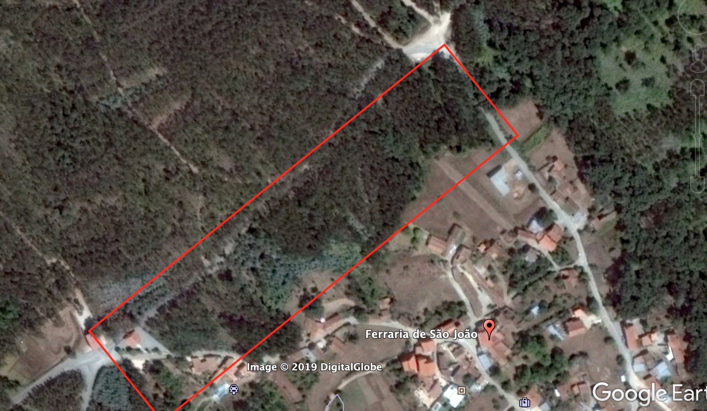
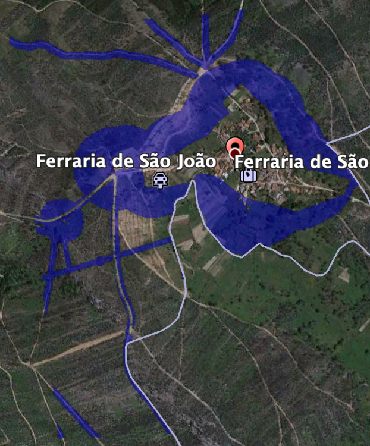

```{r setup, include=FALSE}
knitr::opts_chunk$set(echo = TRUE, cache = TRUE, warning = FALSE, message = FALSE)
```

#Introduction
This paper endevours to demonstrate the use of NDVI (and satellite imagery) to discern whether a Defensible Space (DS) has been cleared or not. The area in question is **Ferraria de Sao Joao** (FDSJ), a small village of few properties (probably not more than 20-30 properties).
```{r loadinglibraries}
#Loading required libraries to undergo the analysis
require(raster)
require(rgdal)
require(gdalUtils)
require(sf)
```

#Background
This piece of work is a followup of the [work done previously on Leiria][1], trying to identify if cleaning occurred in Leiria, as per [KML file provided][2]. The challenge with this piece of work, is that we weren't given info as to when the cleaning occurred, or if indeed it did occur. Therefore, there was no reference point or data to fall back to in order to infer whether NDVI would be a good indicator or not. As such, this piece of work was undertaken.

Below are two images, acquired from Google Earth of FDSJ in 2015 and 2018, and what can be noted from these images, that, directly to the North West of FDSJ (inside the red rectangle), 2015 had rich vegetation, while in 2018 the same area was clearly cut down. Hence, this area was used as a reference point to test the hypothesis of using NDVI to check whether a Defensible Space was cleared or not.

```{r, echo=FALSE,out.width="49%", out.height="20%",fig.cap="08/08/2015",fig.show='hold',fig.align='center'}

```
```{r, echo=FALSE,out.width="49%", out.height="20%",fig.cap="18/06/2018",fig.show='hold',fig.align='center'}
knitr::include_graphics("FDSJ-2018.png")
```

#Satellite Images
It is always preferable to use Sentinel-2 images since they have a high resolution. Unfortunately, July 2015 is when Sentinel went live, therefore the image shown on Google Earth dated for June 2015, is not possible through Sentinel-2. Landsat 8 images were used instead. They have a lower resolution (30m X 30m, instead of 10m X 10m) but still they would serve our purpose, since the areas/features in the polygon are bigger than 30 X 30 (at least the area in question).

Images acquired from Landsat 8, were for 

- Band 5 (NIR) and Band 4(IR)
- For 2015, the images were dated for 29/08/2015
- For 2018, the images were dated for 18/06/2018
- The images can be found [here][3]

#Defensbile Space - Ferraria de Sao Joao
A KML file was used to identify the DS, and it can be found [here][4]. It's a cropped version of the file provided [here][5], by clicking on "Plan Document" > "Info_Geografica/". This was then cross referenced on Google Earth to make sure we have the area in question:

```{r, echo=FALSE,out.width="49%", out.height="20%",fig.cap="Ferraria de Sao Joao with KML superimposed",fig.show='hold',fig.align='center'}

```

```{r readKML}
fdsj<-readOGR("FDSJ.kml")
```

#Loading Images into R
To calculate the NDVI, we will need to the NIR and IR bands (Band 5 and Band 4, respectively). So we'll load both these bands for 2015 and 2018, and calculate the NDVI for each:
```{r loadingimages}
#Load band 4 and 5 for 2015

band4.ls.2015<-raster("Landsat 8/Ferraria de Sao Joao/2015/LC08_L1TP_204032_20150829_20170405_01_T1_B4.tiff")
band5.ls.2015<-raster("Landsat 8/Ferraria de Sao Joao/2015/LC08_L1TP_204032_20150829_20170405_01_T1_B5.tiff")

#Load band 4 and 5 for 2018
band4.ls.2018<-raster("Landsat 8/Ferraria de Sao Joao/2018/LC08_L1TP_204032_20180618_20180618_01_RT_B4.tiff")
band5.ls.2018<-raster("Landsat 8/Ferraria de Sao Joao/2018/LC08_L1TP_204032_20180618_20180618_01_RT_B5.tiff")
```

#Calculating NDVI
To calculate the NDVI using Landsat 8 images, we used the following formula (with reference to Landsat 8 bands):
$$NDVI=\frac{Band5-Band4}{Band5+Band4}$$
```{r ndvicalculate}
#Calculate NDVI for 2015 images
ndvi.ls.2015<-(band5.ls.2015-band4.ls.2015)/(band5.ls.2015+band4.ls.2015)

#Calculate NDVI for 2018 images
ndvi.ls.2018<-(band5.ls.2018-band4.ls.2018)/(band5.ls.2018+band4.ls.2018)
```

#Crop and Plot NDVI (KML superimposed)
Below are NDVI plots for 2015 and 2018 (with the dates mentioned earlier):
```{r cropandplot, fig.align='center'}
#Convert CRS of KML to the same CRS as Landsat8 iamges
fdsj<-spTransform(fdsj, crs(ndvi.ls.2015))

#Crop imamges to show area of interest (FDSJ)
ndvi.ls.2015<-crop(ndvi.ls.2015, extent(fdsj))
ndvi.ls.2018<-crop(ndvi.ls.2018, extent(fdsj))

#Prep canvas for plotting
par(mfrow=c(1,2))

#Plot 2015 NDVI and superimpose KML
plot(ndvi.ls.2015, main="NDVI 2015 of FDSJ")
plot(fdsj, add=TRUE)

#Plot 2018 NDVI and superimpose KML
plot(ndvi.ls.2018, main="NDVI 2018 of FDSJ")
plot(fdsj, add=TRUE)
```

It can be noted from above, that area in question (NW of FDSJ) had its NDVI decrease, just by visually inspecting it. Although a more statistical approach should be considered.

#Statistical Inference
We're going to take a statistical approach to investigate whether a change has happened indeed or not. For that we're going to use [Student's t-test][6], with confidence interval of 95%, after which we'll inspect the mean & P-Value of the two samples (Defensible Spaces, as defined in the KML, between 2015 and 2018), in the hopes to see a P-Value of below 5%.

First, we need to extract the NDVI values pertaining only to the Defensible Space as described in our KML file (blue layer on the Google Earth image):
```{r extractndvi}
#Extract NDVI from 2015 and 2018
ndvi.ls.2015.ds<-extract(ndvi.ls.2015, fdsj)
ndvi.ls.2018.ds<-extract(ndvi.ls.2018, fdsj)

```

Now we have our two samples of NDVIs between 2015 and 2018, as described by the KML file. Now we do some R trickery to convert into a vector (ignore this step, no need to go deep into it, it's basically converting the object into vector(array) of numbers to do the T Test). 
```{r convert2vector}
#Convert to vector from list
ndvi.ls.2015.ds<-unlist(ndvi.ls.2015.ds)
ndvi.ls.2018.ds<-unlist(ndvi.ls.2018.ds)
```

And now we perform Student's t-test and observe the means and P-Value:
```{r pvalue}
t.test(ndvi.ls.2015.ds, ndvi.ls.2018.ds)
```

From the above it can be noted that the mean NDVI in 2015 of all the Defensible Spaces (mean of x) is 0.33, while mean NDVI in 2018 for the same area is 0.29; approx 14% difference/decrease.

Further dissection of the test, we can note that the p-value is well below 0.05 and as such this gives a strong indication that this is a statistically significant result. Although there are some caveats to this, which are addressed in the following section.

We can also inspect this visually by having a frequency plots for NDVIs for each year:
```{r histo}
par(mfrow=c(1,2))
hist(ndvi.ls.2015.ds, main="NDVI Distribution 2015", xlab="NDVI")
abline(v=mean(ndvi.ls.2015.ds, na.rm=TRUE), col='red', lwd=2)
hist(ndvi.ls.2018.ds, main="NDVI Distribution 2018", xlab="NDVI")
abline(v=mean(ndvi.ls.2018.ds, na.rm=TRUE), col='red', lwd=2)
```

#Caveats
This study is not a silver bullet in identifying Defensible Spaces, but it's definitely a step in the right direction. With this in consideration, there are a few caveats to contend with, which are detailed below:

###We Can't Rely on One Data Point
This analysis deals with one area only, and in order to make this finding more concrete more areas should be studied. Generally speaking, although by no means a set rule in statistics, but having a sample of 30+ should start giving us more reliable results

###Noise, External Effects, and Seasonality
We have to take into account for external affects, such moisture, seasonality fluctuations, etc... The difference in NDVI averages between 2015 and 2018, could be due to external factors (noise essentially), and as such this should be accounted for and removed. From one data point, this can't be ascertained.

###Resolution of Images
The smallest area that needs to be checked, is the DS around roads: 10m on either side of the road. Although Sentinel-2 resolution is 10m, it will hardly be the case where a pixel will lie sqaurly inside the polygons drawn around the roads. The most likely scenario, that there will be a collection of pixels intersecting inside the polygon. Each of these pixels will most likely have the "average" NDVI between the DS and the area next to it. This can be tackled at later stages. The DS of 50m and 100m radii can be tackled initially to get a better understanding of the challenge at hand, before undertaking road clearing.

###Statistical Distribution
[Studente's t-test][6] is applied on [normally distributed samples][7]. Considering the entirety of the NDVI samples collected through Landsat images, the NDVI distribution is indeed normally distributed. But when considering only the Defensible Space NDVI values, they don't show a normal distribution, but this can be address with [Bootstrapping][8]. Furthermore, since the entirety of the NDVI sample is normally distributed, we can with certainty assume that the two samples are indeed different samples, and rely on that p-value instead.

###Definition of "Cleaning" Defensible Spaces
We need to ascertain (and we are doing it right now) what "cleaning" a DS is. It was assumed that trees and vegetation was cleared out completely, as per the mandated distances (10m, 50m, 100m). After discussions this assumption didn't have a 100% certainty, therefore confirmation from municipalities and a clear definition of "cleaning" should attained first.

#Conclusion
As mentioned earlier, this analysis doesn't provide a silver bullet in identifying whether cleaning has happened or not. Although it's a step in the right direction, where it showed, given a known cleaning/clearing has happened, NDVI may be used to identify as a form of inspection.

[1]: https://images.app.goo.gl/uqpSY1gysmouir4v6
[2]: https://images.app.goo.gl/uqpSY1gysmouir4v6
[3]: https://images.app.goo.gl/uqpSY1gysmouir4v6
[4]: https://images.app.goo.gl/uqpSY1gysmouir4v6
[5]: https://fogos.icnf.pt/infoPMDFCI/PMDFCI_PUBLICOlist.asp?cmd=search&t=PMDFCI_PUBLICO&z_Distrito=%3D&x_Distrito=Coimbra&z_Concelho=%3D&x_Concelho=Penela&psearch=&psearchtype=
[6]: https://en.wikipedia.org/wiki/Student%27s_t-test
[7]: https://en.wikipedia.org/wiki/Normal_distribution
[8]: https://en.wikipedia.org/wiki/Bootstrapping_(statistics)